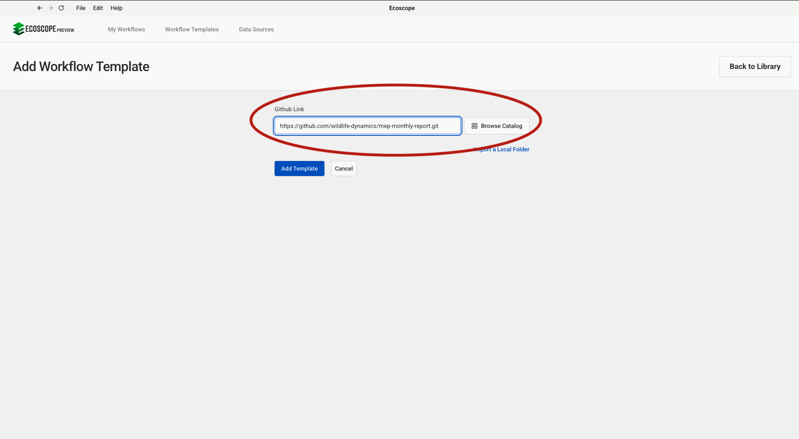
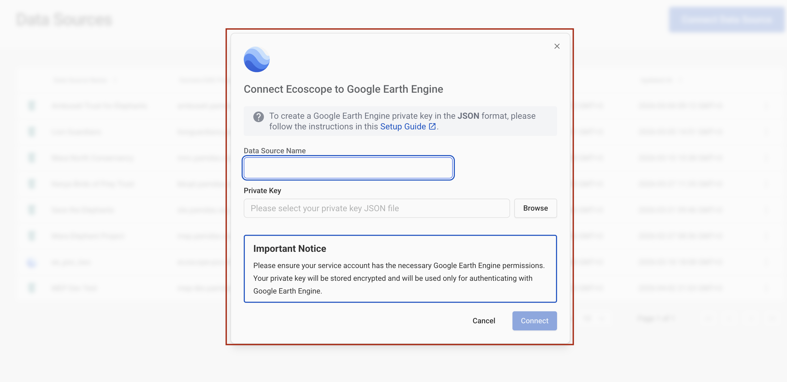
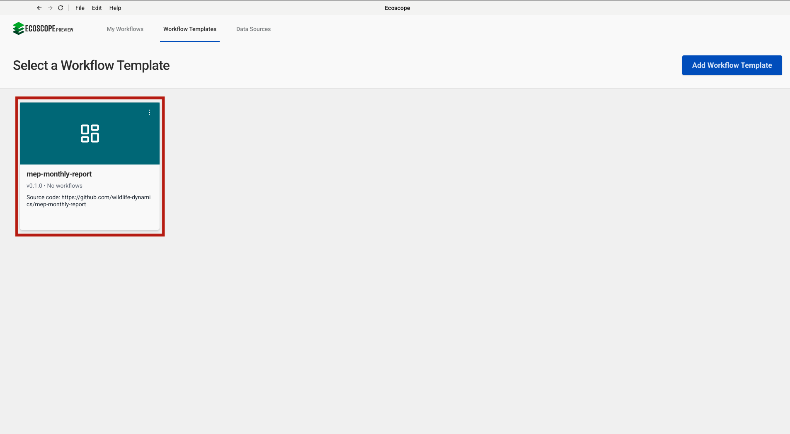
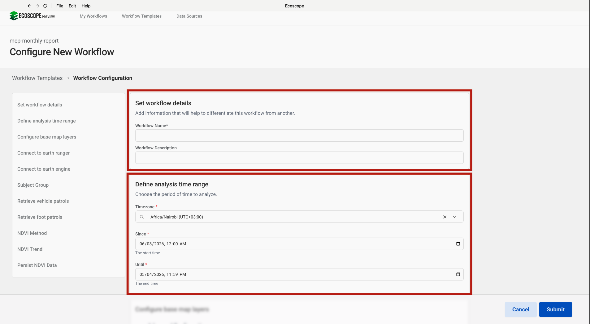
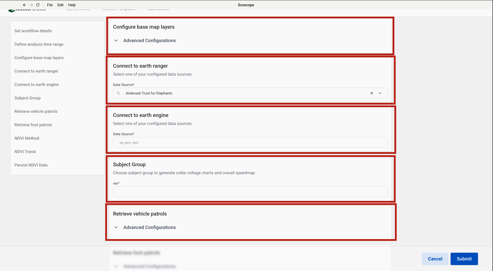
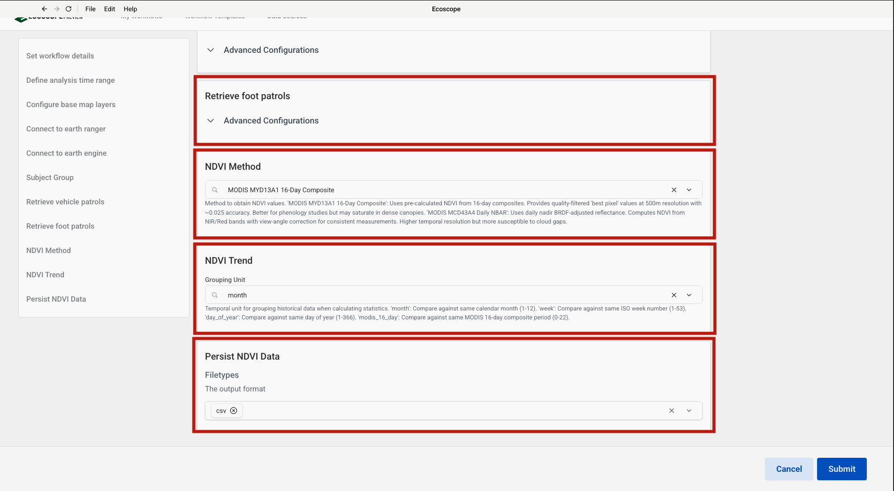

# MEP Monthly Report — User Guide

This guide walks you through configuring and running the MEP Monthly Report workflow, which ingests elephant sightings, collar GPS tracks, vehicle and foot patrol data, and NDVI trends from EarthRanger and Google Earth Engine to produce a comprehensive monthly report for the Mara Elephant Project.

---

## Overview

The workflow delivers, for each run:

- **4 maps** — elephant sightings scatter map, GPS speedmap, vehicle patrol trajectories map, and foot patrol trajectories map
- **Per-subject collar voltage charts** — GPS fix-rate and voltage timeline vs previous period for each collared animal
- **1 sitrep CSV** — situation report with incident counts by region
- **NDVI trend charts** — one per named region of interest, showing current NDVI vs historic min/max/mean band
- **A Word document report** — cover page and populated content page merged into a single monthly report

---

## Prerequisites

Before running the workflow, ensure you have:

- Access to an **EarthRanger** instance with `mep_elephant_sighting` events, subject group observations, vehicle patrol, and foot patrol data logged for the analysis period
- Access to a **Google Earth Engine** service account with a private key in JSON format

---

## Step-by-Step Configuration

### Step 1 — Add the Workflow Template

In the workflow runner, go to **Workflow Templates** and click **Add Workflow Template**. Paste the GitHub repository URL into the **Github Link** field:

```
https://github.com/wildlife-dynamics/mep-monthly-report.git
```

Then click **Add Template**.



---

### Step 2 — Configure Connection

Navigate to **Data Sources** and click **Connect**. A dialog will appear prompting you to **Select Data Source Type**. This workflow requires two connections:

| Data Source Type | Purpose |
|-----------------|---------|
| **EarthRanger** | Pull elephant sighting events, subject group observations, vehicle and foot patrol data, and sitrep events |
| **Google Earth Engine** | Compute NDVI trend time series per region of interest |

Select **EarthRanger** first and complete Step 3, then repeat and select **Google Earth Engine** for Step 4.


---

### Step 3 — Add an EarthRanger Connection

After selecting **EarthRanger** in Step 2, fill in the connection form:

- **Data Source Name** — a label to identify this connection
- **EarthRanger URL** — your instance URL (e.g. `your-site.pamdas.org`)
- **EarthRanger Username** and **EarthRanger Password**

> Credentials are not validated at setup time. Any authentication errors will appear when the workflow runs.

Click **Connect** to save.


---

### Step 4 — Add a Google Earth Engine Connection

After selecting **Google Earth Engine** in Step 2, fill in the connection form:

- **Data Source Name** — a label to identify this connection
- **Private Key** — click **Browse** to select your GEE service account private key file (JSON format)

> To generate a private key, follow the instructions in the [Setup Guide](https://developers.google.com/earth-engine/guides/service_account). The key is stored encrypted and used only to authenticate with Google Earth Engine.

Click **Connect** to save.



---

### Step 5 — Select the Workflow

After the template is added, it appears in the **Workflow Templates** list as **mep-monthly-report**. Click it to open the workflow configuration form.

> The card may show **Initializing…** briefly while the environment is set up.



---

### Step 6 — Set Workflow Details and Analysis Time Range

The configuration form opens with two sections at the top.

**Set workflow details**

| Field | Description |
|-------|-------------|
| Workflow Name | A short name to identify this run |
| Workflow Description | Optional notes (e.g. month, site, or reporting period) |

**Define analysis time range**

| Field | Description |
|-------|-------------|
| Timezone | Select the local timezone (e.g. `Africa/Nairobi UTC+03:00`) |
| Since | Start date and time of the analysis period |
| Until | End date and time of the analysis period |

All events, observations, patrol data, and GEE NDVI values are fetched within this window.



---

### Step 7 — Configure Base Maps, Connect to EarthRanger and Earth Engine, Set Subject Group, and Retrieve Vehicle Patrols

Scroll down to configure the next five sections.

**Configure base map layers**

Expand **Advanced Configurations** to select the base map tile layers displayed on all maps.

**Connect to earth ranger**

Select the EarthRanger data source configured in Step 3 from the **Data Source** dropdown (e.g. `Amboseli Trust for Elephants`).

**Connect to earth engine**

Select the Google Earth Engine data source configured in Step 4 from the **Data Source** dropdown.

**Subject Group**

Enter the name of the EarthRanger subject group in the field (e.g. `MEP`). This group is used to generate collar voltage charts and the overall GPS speedmap.

**Retrieve vehicle patrols**

Expand **Advanced Configurations** to review or override the default vehicle patrol trajectory segment filter thresholds (max length: 5 000 m, max time: 18 000 s, speed: 10–100 km/h).



---

### Step 8 — Configure Foot Patrols, NDVI Method, NDVI Trend, and Persist NDVI Data

Scroll down to configure the final four sections, then click **Submit**.

**Retrieve foot patrols**

Expand **Advanced Configurations** to review or override the default foot patrol trajectory segment filter thresholds (max length: 5 000 m, max time: 14 400 s, speed: 0.5–9 km/h).

**NDVI Method**

Select the method used to obtain NDVI values from Google Earth Engine:

| Option | Description |
|--------|-------------|
| **MODIS MYD13A1 16-Day Composite** | Pre-calculated NDVI from 16-day composites. Quality-filtered 'best pixel' values at 500 m resolution. Better for phenology studies but may saturate in dense canopies. |
| **MODIS MCD43A4 Daily NBAR** | Daily nadir BRDF-adjusted reflectance. NDVI computed from NIR/Red bands with view-angle correction. Higher temporal resolution but more susceptible to cloud gaps. |

The default is **MODIS MYD13A1 16-Day Composite**.

**NDVI Trend**

Set the **Grouping Unit** for the NDVI time-series aggregation (e.g. `month`). This controls the temporal resolution at which NDVI values are grouped and plotted against the historic min/max/mean band.

**Persist NDVI Data**

Set the **Filetype** for the exported NDVI data. The default output format is **csv**.

Once all parameters are set, click **Submit**.



---

## Running the Workflow

Once submitted, the runner will:

1. Fetch `mep_elephant_sighting` events; remove spatial outliers and null geometries; generate sightings scatter map.
2. Fetch subject group observations for the current and previous periods; produce per-subject collar voltage charts.
3. Convert GPS observations to trajectories; classify speed into 6 bins; generate speedmap.
4. Compile sitrep report from EarthRanger events; persist as CSV.
5. Fetch vehicle patrol observations for 11 team types; convert to trajectories; generate vehicle patrol map.
6. Fetch foot patrol observations for 11 team types; convert to trajectories; generate foot patrol map.
7. Download the ROI GeoPackage from Dropbox; split by named area; compute NDVI trends per ROI via Google Earth Engine.
8. Render NDVI trend charts (current NDVI vs historic min/max/mean band); persist as HTML and CSV; convert to PNG.
9. Download Word templates from Dropbox; populate cover page and content page with all maps, charts, and sitrep data.
10. Merge cover page and content page into the final Word report.
11. Save all outputs to the directory specified by `ECOSCOPE_WORKFLOWS_RESULTS`.

---

## Output Files

All outputs are written to `$ECOSCOPE_WORKFLOWS_RESULTS/`. Files marked with `<subject>` are produced once per collared subject; files marked with `<area>` are produced once per named ROI.

| File | Description |
|------|-------------|
| `elephant_sightings_map.html` / `.png` | Scatter map of elephant sighting events |
| `speedmap.html` / `.png` | GPS trajectories coloured by 6-bin speed classification |
| `vehicle_patrols_map.html` / `.png` | Vehicle patrol trajectories coloured by team |
| `foot_patrols_map.html` / `.png` | Foot patrol trajectories coloured by team |
| `vehicle_patrol_trajectories.geoparquet` | Raw vehicle patrol trajectory data |
| `foot_patrol_trajectories.geoparquet` | Raw foot patrol trajectory data |
| `sitrep_report.csv` | Situation report — incident counts and categories by region |
| `<subject>_collar_voltage.html` / `.png` | Collar voltage and GPS fix-rate chart (current vs previous period) |
| `ndvi_<area>.html` / `.png` | NDVI trend chart vs historic min/max/mean band |
| `ndvi_<area>.csv` | NDVI time-series data per region |
| `mep_cover_page.docx` | Populated Word cover page |
| `mep_context.docx` | Populated Word content page |
| `overall_mep_monthly_report.docx` | Final merged Word monthly report |
