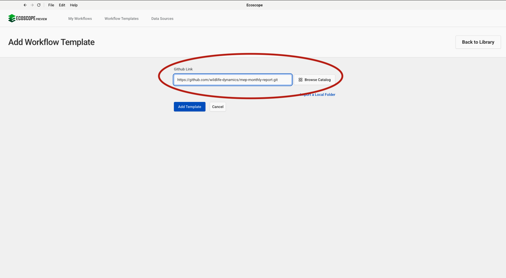
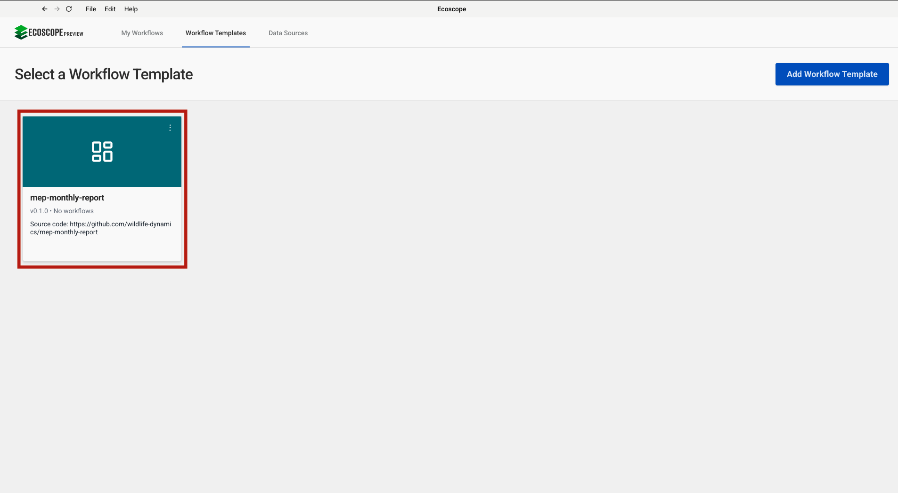
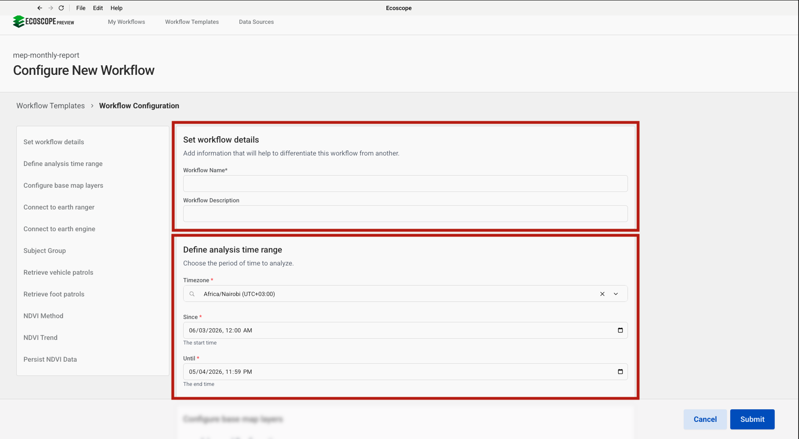

# MEP Monthly Report — User Guide

This guide walks you through configuring and running the MEP Monthly Report workflow, which ingests events, collar GPS tracks, and vehicle and foot patrol data from EarthRanger to produce a comprehensive monthly report and interactive dashboard for the Mara Elephant Project.

---

## Overview

The workflow delivers, for each run:

- **4 maps** — events scatter map (coloured by event type), GPS speedmap, vehicle patrol trajectories map, and foot patrol trajectories map
- **Per-subject historic voltage charts** — current-period collar voltage vs. a previous-period min/mean/max band, for each collared subject
- **1 sitrep table + CSV** — situation report with incident counts by region, both as a dashboard table and a CSV export
- **1 events CSV** — all fetched events with their details flattened into columns
- **An interactive dashboard** — 6 widgets: Collar Voltage, Elephant Sightings Map, Speed Map, Vehicle Patrols Map, Foot Patrols Map, and the Sitrep Report table
- **A Word document report** (`overall_report.docx`) — populated with every map, chart, and the sitrep table
- **A separate Word cover page** (`mep_monthly_cover_page.docx`) — organisation logo (auto-downloaded, not user-configurable), report period, and prepared-by

---

## Prerequisites

Before running the workflow, ensure you have:

- Access to an **EarthRanger** instance with events, subject group observations, vehicle patrol, and foot patrol data logged for the analysis period

---

## Step-by-Step Configuration

### Step 1 — Add the Workflow Template

In the workflow runner, go to **Workflow Templates** and click **Add Workflow Template**. Paste the GitHub repository URL into the **Github Link** field:

```
https://github.com/wildlife-dynamics/mep-monthly-report.git
```

Then click **Add Template**.



---

### Step 2 — Add an EarthRanger Connection

Navigate to **Data Sources** and add a new EarthRanger connection. Fill in:

- **Data Source Name** — a label to identify this connection
- **EarthRanger URL** — your instance URL (e.g. `your-site.pamdas.org`)
- **EarthRanger Username** and **EarthRanger Password**

> Credentials are not validated at setup time. Any authentication errors will appear when the workflow runs.


---

### Step 3 — Select the Workflow

After the template is added, it appears in the **Workflow Templates** list as **mep-monthly-report**. Click it to open the workflow configuration form.

> The card may show **Initializing…** briefly while the environment is set up.



---

### Step 4 — Set Workflow Details and Time Range

The configuration form opens with two sections at the top.

**Set Workflow Details**

| Field | Description |
|-------|-------------|
| Workflow Name | A short name to identify this run |
| Workflow Description | Optional notes (e.g. month, site, or reporting period) |

**Time Range**

| Field | Description |
|-------|-------------|
| Timezone | Select the local timezone (e.g. `Africa/Nairobi UTC+03:00`) |
| Since | Start date and time of the current analysis period |
| Until | End date and time of the current analysis period |

All events, observations, and patrol data are fetched within this window.



---

### Step 5 — Configure Base Maps, Connect to EarthRanger, and Set Subject Group

Scroll down to configure the next three sections.

**Configure Base Map Layers**

Expand **Advanced Configurations** to select the base map tile layers displayed on all maps.

**Connect to EarthRanger**

Select the EarthRanger data source configured in Step 2 from the **Data Source** dropdown.

**Subject Group**

Enter the name of the EarthRanger subject group in the field (e.g. `MEP`). This group is used to generate historic voltage charts and the overall GPS speedmap.

---

### Step 6 — Configure the Previous Period

**Previous Period**

Every option below computes a comparison period that ends on the same **Start Date** as your current time range (so the two periods never overlap) — only the comparison period's own Start Date changes:

| Mode | Description |
|------|-------------|
| Custom | Enter your own Years / Months / Weeks / Days offset (defaults to 1 month back) |
| Preset | Choose a common lookback: 1, 3, or 6 months, or 1 year back |
| Calendar | Pick an exact Start Date |

The previous period's relocations are used solely to compute each subject's historic min/mean/max voltage band; if no previous-period data is found, the band collapses to the current period's own values.

---

### Step 7 — Retrieve Vehicle Patrols

**Retrieve vehicle patrols**

Expand **Advanced Configurations** to review or override the default vehicle patrol trajectory segment filter thresholds (max length: 5 000 m, max time: 18 000 s, speed: 10–100 km/h).

---

### Step 8 — Configure Foot Patrols

Scroll down to configure the final section, then click **Submit**.

**Retrieve foot patrols**

Expand **Advanced Configurations** to review or override the default foot patrol trajectory segment filter thresholds (max length: 5 000 m, max time: 14 400 s, speed: 0.5–9 km/h).

Once all parameters are set, click **Submit**.

---

## Running the Workflow

Once submitted, the runner will:

1. Fetch all events, flatten their `event_details` JSON, and persist the raw events as CSV (`events.csv`); apply the tab20 colour palette by event type and generate the events scatter map.
2. Fetch subject group observations for the current time range, convert `fixtime` to the analysis timezone, derive relocations, sort by `fixtime`, and persist as GeoParquet (`relocations.parquet`).
3. Fetch subject group observations for the computed previous period and process them the same way, persisting `previous_period_relocations.parquet`.
4. Extract each relocation set's `voltage` column from `observation_details` (checking `battery`, `mainVoltage`, `batt`, `power` in order), split both sets by subject, and pair each subject's current and previous slices together.
5. Plot each subject's historic voltage chart — current voltage against the previous period's min/mean/max band (falls back to the current period alone when no previous-period data exists) — and convert each to PNG.
6. Convert the current period's relocations to trajectories; classify speed into 6 bins; generate the speedmap.
7. Compile the sitrep report from EarthRanger events, persist it as CSV, and also render it as a sortable/filterable dashboard table.
8. Fetch vehicle patrol observations; convert to trajectories; generate the vehicle patrol map.
9. Fetch foot patrol observations; convert to trajectories; generate the foot patrol map.
10. Download the Word report template, cover page template, and the MEP organisation logo from Dropbox.
11. Generate the monthly report (`overall_report.docx`) — every chart and map found in the results directory, plus the sitrep table, populated into the content template.
12. Generate a separate cover page (`mep_monthly_cover_page.docx`) — MEP logo, report period, and prepared-by.
13. Assemble the interactive dashboard (Collar Voltage, Elephant Sightings Map, Speed Map, Vehicle Patrols Map, Foot Patrols Map, Sitrep Report) and save all outputs to the directory specified by `ECOSCOPE_WORKFLOWS_RESULTS`.

> Unlike earlier versions of this workflow, events are no longer filtered for spatial outliers or null geometries before mapping — they are fetched with `force_point_geometry: true` and mapped directly.

---

## Output Files

All outputs are written to `$ECOSCOPE_WORKFLOWS_RESULTS/`. Files marked with `<subject>` are produced once per collared subject.

| File | Description |
|------|-------------|
| `events.csv` | All fetched events with `event_details` flattened into columns |
| `elephant_sightings_map.html` / `.png` | Scatter map of all events, coloured by event type |
| `elephant_speedmap.html` / `.png` | GPS trajectories coloured by 6-bin speed classification |
| `vehicle_patrols_map.html` / `.png` | Vehicle patrol trajectories coloured by team |
| `foot_patrols_map.html` / `.png` | Foot patrol trajectories coloured by team |
| `vehicle_patrol_trajectories.geoparquet` | Raw vehicle patrol trajectory data |
| `foot_patrol_trajectories.geoparquet` | Raw foot patrol trajectory data |
| `relocations.parquet` | All subjects' current-period relocations, including the extracted `voltage` column |
| `previous_period_relocations.parquet` | All subjects' previous-period relocations, including the extracted `voltage` column |
| `<subject>_historic_voltage.html` / `.png` | Historic voltage chart — current voltage vs. previous-period min/mean/max band |
| `sitrep_report.csv` | Situation report — incident counts and categories by region |
| `sitrep_report_table.html` | Sitrep report rendered as a sortable/filterable table (dashboard widget source) |
| `mep_monthly_cover_page.docx` | Populated Word cover page (MEP logo, report period, prepared-by) |
| `overall_report.docx` | Final Word monthly report (every map, chart, and the sitrep table) |
