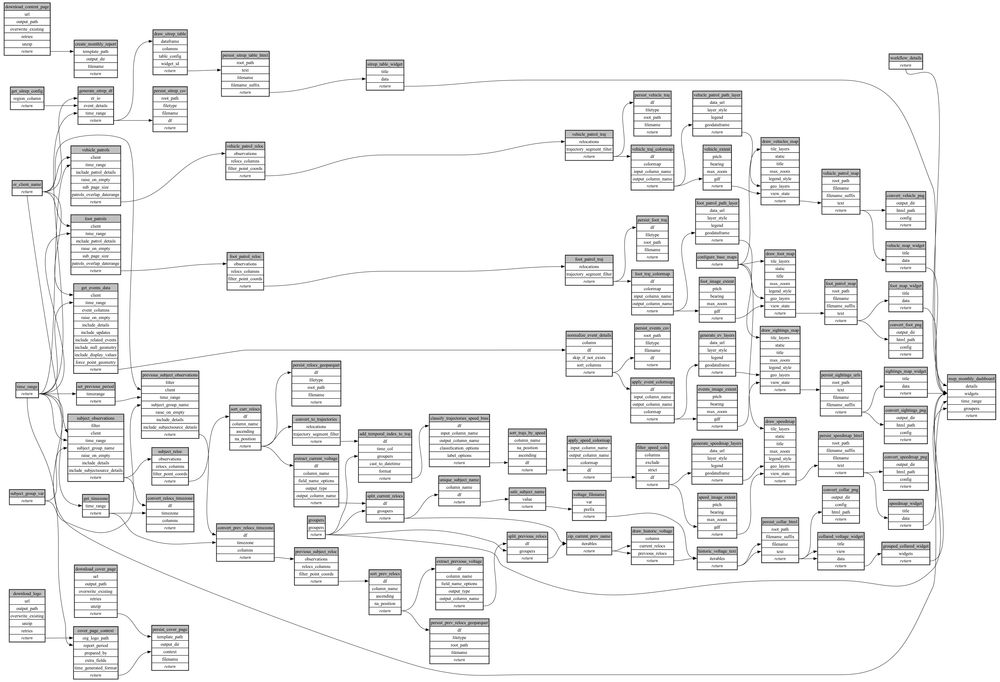

```
# AUTOGENERATED BY ECOSCOPE-WORKFLOWS; see fingerprint in README.md for details

```

```yaml
# fingerprint:
artifacts_sha256_basic: dc7bc878510f4adfffe911fdb76cbc59be12c9f7e1173990fd5be20a85c3c51d
artifacts_sha256_strict: dcf2c18c8b1c51c68de0b28f8fa96b8743f3b69627d1896cf0dfffd8d032b519
installed_requirements:
- channel: https://repo.prefix.dev/ecoscope-workflows/
  name: ecoscope-platform
  version: {version: ==2.15.1}
- channel: https://repo.prefix.dev/ecoscope-workflows-custom/
  name: ecoscope-workflows-ext-custom
  version: {version: ==0.1.0rc14}
- channel: https://repo.prefix.dev/ecoscope-workflows-custom/
  name: ecoscope-workflows-ext-ste
  version: {version: ==0.0.0rc1}
- channel: https://repo.prefix.dev/ecoscope-workflows-custom/
  name: ecoscope-workflows-ext-mep
  version: {version: ==1.0.1}
- channel: conda-forge
  name: pydeck
  version: {version: ==0.9.2}
- channel: conda-forge
  name: opentelemetry-sdk
  version: {version: ==1.44.0}
params_sha256: 7a734aa43309e4335e1aadc6159a1bcc8963de0ada4a6c47ada22047afb26148
spec_sha256: 2701994b0adb8f3793fe15fb07d17333aa6820f1151045f54bfcd2c0b9549bf0

```

# ecoscope-workflows-monthly-report-workflow


